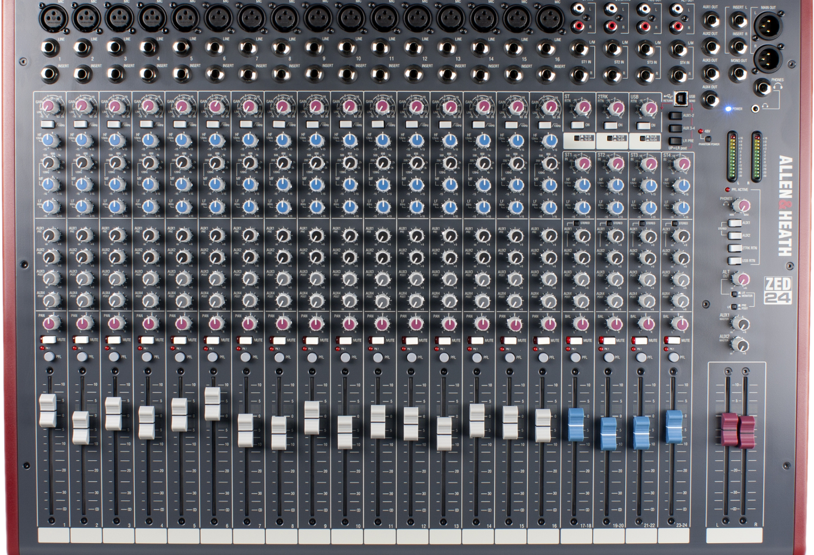
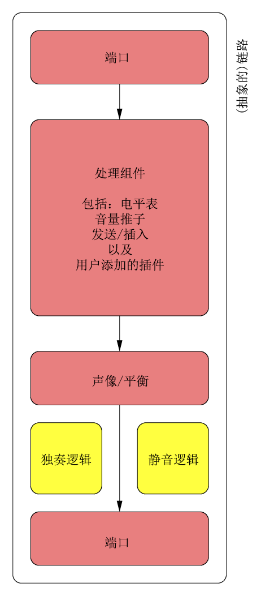

# 第三章 结构设计与基本组件
## 6 总览

<b>图 9</b> Allen & Heath ZED-24 硬件调音台。

要描述并构建延迟补偿的机制，需要一个由所有涉及的组件构成的模型。建模操作的第一步便是辨认设计中的一般结构。

在概念上，数字音频工作站会区分轨道和总线。轨道用于录制与回放媒体，而总线用于合并轨道和混音。一个轨道的信号通常会输出至一个或多个总线。

从基本层面来看，所有流经系统的数据均可建模为一个通道条（channel-strip），这是一种单音频输入，单音频输出的黑盒，能以任意方式连接。“通道条”一词的历史含义源自模拟调音台，在这种调音台中，信号自顶向下流动，其中包括处理，这些处理通常是均衡和立体声声像调整。调音台中的多个通道条相互紧挨，排成一行，因此名称中有个“条”（strip）字。见图 9。

Ardour 遵循了这种命名规范，其基本的内部对象是一种成条对象（stripable）。不过 Arduor 中，这不过是一种为多种用户界面用途（如选择和排序）提供一般状态和抽象的虚拟对象，同样显示为条状。混音器中的通道条可能是个纯粹的控制对象，实际上并不进行数据处理（如 VCA）。

## 7 结构设计

处理数据的链路适合描述为链路（route），即一个包含总线和轨道机制的抽象化对象，用于信号链路。

链路包含输入和输出的端口（port）。虽然传统的通道条通常带单声道输入和立体声输出，但抽象的端口并不受限于此。使用“链路”一词是源自其主要功能：其用于描述将音频（或 MIDI）信号从一处引导至另一处的操作。图 10 描绘了由链路对象构成的基本组件。

一条总线基本上就是一个链路。尽管“链路”一词指代的是描述功能和接口的抽象模型，但“总线”一词用于提供用途的语义。和总线相比，轨道还具有提供录制和回放能力的功能。

> 面向对象中类的术语：
> - “甲是乙”意为甲派生自乙。
> - “甲包含乙”意为甲中至少有一个成员是乙。

遵循上述术语，可以将 DAW 中的基本对象描述为：
- 链路是成条对象；
- 轨道是链路；
- 链路包含输入/输出接口；
- 链路包含处理组件；
- 轨道是包含硬盘 I/O 处理组件的链路。

<b>图 10</b> 链路对象的基本概念抽象

链路本身是原子的，即链路内的信号处理是线性的，无法从外部打断。如果链路依赖其他链路的输出，则需等待其他链路输出，才能完成处理。

注意：除特别标注外，后文描述的 Ardour 的内部机制均指代 Ardour 6 的设计和实现。