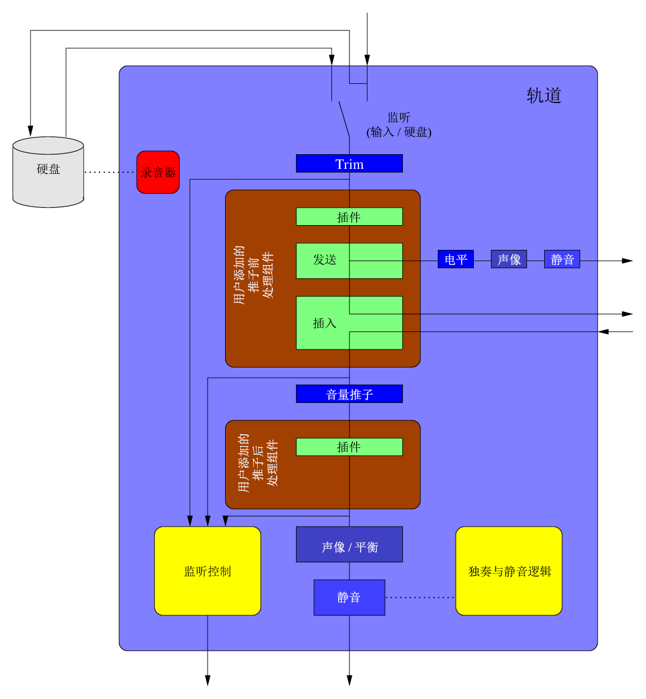

# 第三章 结构设计与基本组件
## 6 总览

<b>图 9</b> Allen & Heath ZED-24 硬件调音台。

要描述并构建延迟补偿的机制，需要一个由所有涉及的组件构成的模型。建模操作的第一步便是辨认设计中的一般结构。

在概念上，数字音频工作站会区分轨道和总线。轨道用于录制与回放媒体，而总线用于合并轨道和混音。一个轨道的信号通常会输出至一个或多个总线。

从基本层面来看，所有流经系统的数据均可建模为一个通道条（channel-strip），这是一种单音频输入，单音频输出的黑盒，能以任意方式连接。“通道条”一词的历史含义源自模拟调音台，在这种调音台中，信号自顶向下流动，其中包括处理，这些处理通常是均衡和立体声声像调整。调音台中的多个通道条相互紧挨，排成一行，因此名称中有个“条”（strip）字。见图 9。

Ardour 遵循了这种命名规范，其基本的内部对象是一种成条对象（stripable）。不过 Arduor 中，这不过是一种为多种用户界面用途（如选择和排序）提供一般状态和抽象的虚拟对象，同样显示为条状。混音器中的通道条可能是个纯粹的控件对象，实际上并不进行数据处理（如 VCA）。

## 7 结构设计

处理数据的链路适合描述为链路（route），即一个包含总线和轨道机制的抽象化对象，用于信号链路。

链路包含输入和输出的端口（port）。虽然传统的通道条通常带单声道输入和立体声输出，但抽象的端口并不受限于此。使用“链路”一词是源自其主要功能：其用于描述将音频（或 MIDI）信号从一处引导至另一处的操作。图 10 描绘了由链路对象构成的基本组件。

一条总线基本上就是一个链路。尽管“链路”一词指代的是描述功能和接口的抽象模型，但“总线”一词用于提供用途的语义。和总线相比，轨道还具有提供录制和回放能力的功能。

> 面向对象中类的术语：
> - “甲是乙”意为甲派生自乙。
> - “甲包含乙”意为甲中至少有一个成员是乙。

遵循上述术语，可以将 DAW 中的基本对象描述为：
- 链路**是**成条对象；
- 轨道**是**链路；
- 链路**包含**输入/输出接口；
- 链路**包含**处理组件；
- 轨道**是****包含**硬盘 I/O 处理组件的链路。

<b>图 10</b> 链路对象的基本概念抽象

链路本身是原子的，即链路内的信号处理是线性的，无法从外部打断。如果链路依赖其他链路的输出，则需等待其他链路输出，才能完成处理。

注意：除特别标注外，后文描述的 Ardour 的内部机制均指代 Ardour 6 的设计和实现。

<b>图 11</b> 先前（Ardour 3-5）轨道对象的概念抽象。绿色的处理组件由用户添加。蓝色代表增益层级（gain-staging）以及内部需要的处理组件。注意，磁盘输入/输出和监听用轨道输入处的开关进行特别的处理。这种架构不用于延迟补偿。

<b>图 12</b> 重新设计后的轨道对象的抽象，其中一切皆为处理组件。顺序并不固定，在少量限制下，处理组件可以自由重排。绿色代表可选的，由用户添加的处理组件和插件。链路（总线）不包含红色的磁盘输入/输出处理组件。

## 8 内部链路架构

从外部来看，链路对象是一个由接口抽象的不透明对象。在链路内部，所有的信号处理均由处理组件进行，这些组件既可以是插件，也可以是内置的 DSP 组件。处理组件如同一个小型的链路：组件包含输入和输出，可能会引入延迟。然而，处理链恒为线性。有一种启发自 cue-monitoring 的有趣的设计方式是将硬盘的 I/O 变为通用的处理组件（比较图 11 与图 12）。这种方式提升了链路内处理的整体一致性，得以在内部干净地划分输入延迟和输出延迟，以及控件参数和自动化事件的对齐。

处理组件描述如下：
- 处理组件**是**可自动化对象（`Automatable`）
- 自动化对象**包含**自动化控件
- 自动化控件**包含**参数
- 自动化控件**包含**控件事件（`ControlEvent`）列表

“可自动化对象”类抽象了对依靠时间的控件参数的功能。例如，在切换走带启动和停止的过程中，需要初始化一个新的自动化写事件。可自动化对象的实例也含有给定处理组件的所有参数的列表。

自动化控件首先用作参数，其描述控件范围（最小值、最大值、默认值），控件的单位（dB、Hz 等）以及控件的属性，如刻度（线性、对数），插值（离散，线性，对数，指数）和粒度（整数、开关、浮点）。参数也可以定义带有标注枚举刻度的特定范围。

自动化控件封装了参数对象，并添加了所有控件参数共用的功能：自动化模式（读、写、闩、裁、手动）以及控件事件列表。事件列表基本上就有一个时间戳/数值对的列表。自动化控件对象还提供修改、运算以及给定任意时刻对参数值进行插值的方式。

自动化控件对象也可以依赖于（从动于）其他控件。这一点由超类进行建模：
- 可从动自动化控件**是**自动化控件
- 可自动化对象是可从动对象
- 可自动化对象**包含**可从动控件列表

Ardour 带有嵌套和链式的从动控件列表。一个控件可从动于多个可从动自动化控件（即嵌套），同时从动的自动化控件可以控制其他从动控件（链式）。为了进行维护，每个可从动自动化控件都会维护自身的主动控件列表，顶层的自动化组件带有一个关系表。

## 9 自动化事件处理

处理控件有两种不同方式：
- 持续运算：控件参数值以特定的控制速率（常称作 k-rate）进行计算。
- 基于事件的运算：控件参数仅当发生改变时进行计算。

持续运算的好处在于其能够产出可靠结果，在对自动化参数进行插值和加减速时尤其如此。然而这种方式计算控件值时需要依赖图，而图需要与音频执行图同步，自身不对与外部事件的交互提供功能。添加的开销也很高昂。csound 是一个使用特定控件速率的系统，其中“通常控件速率设定的范围在采样率的 1/10 到 1/100 之间”。

Ardour 的控制系统是基于事件的。这使得 MIDI 成为一等公民，自身即是自动化控件（MIDI 的 Control Change 事件）。参数按需懒求值，依赖链不可见。其中不含控件图。由于不使用特定的控件速率，事件可以尽可能稠密，提供了精确到采样的自动化能力。

有些插件标准允许将当前处理循环完整的事件表传给插件。这一点对于 Ardour 所有的内部处理组件也成立：例如，推子增益控件和声像器中的放大器。将 MIDI 事件作为完整事件列表传入插件，之后再调用插件处理也很常见。对于不支持这种模式的插件，以及防止自动化事件不与处理循环对齐的情况，单个处理组件的循环可以拆分：例如，1024 采样的循环中，某个均衡器可以处理 300 个采样，更新控制值后便剩下 724 个采样需要处理。Ardour 的实现拆分处理并不是为了插值，而仅仅是为了特定事件，从而达到由事件指定的目标值，然而，控件值仍然至少会在每次循环中作插值。

由于自动化数据标有时间戳，根据局部环境，数据必须根据链路的处理链作偏移。如图 13 所示。这是一个局部的效果器，由链路的输入和输出端口从完整的整体对齐抽象了出来。单个链路中，用于全局电平的概念仍适用于此处，即输入端口的捕获延迟和输出的回放延迟。

## 10 端口

端口对 DAW 内的连接缓冲区，以及与外部的连接进行了抽象化。

然而，端口自身并不提供二者的功能。端口主要的用途在于为可能的连接制定协议。端口是单向的。端口要么是输入端口，要么是输出端口，只能按照方向连接。例如，USB A-B 端口（图 14）便是一种在物理层面限制的方式。

端口具有属性，其在注册（创建）端口时设置：端口可以处理的数据类型（音频或 MIDI）、端口的方向（输入或输出）以及表 2 中列入的其他标志位。

注意，输入和输出的语义是从连接的角度描述的。输出端口连接至输入端口。读取输出端口的信号，写入输入端口。

在链路内，读写语义相反。输入端口提供数据，供链路处理（读取）。从链路的角度看，链路的输入（顶端）也是一个输入端口：端口接收从外部（另一端口）写入的数据。数据被提供给链路，以进行处理。到了链路末尾，数据写入输出端口，可供一个或多个输入接口读取（如图 15）。

由端口抽象化的实际负载是音频或 MIDI 数据缓冲区。这一点增添了一层限制，因为只有相同数据类型的端口才能相连。端口自身不管理连接，但允许查询自身连接的端口。端口还会提供连接或断开连入或连出的接口。负载缓冲区也不由端口持有，端口只提供用于取缓冲区的接口。连接管理与数据处理的功能由接口引擎提供。

不过，端口拥有额外的元数据，描述提供了端口的对象：

- 名称：用于标识端口的唯一名字
- 显示名称：人类可读的名称，可拥有语义
- 私有延迟：拥有端口的对象本身的延迟，通常是链路（内部用）
- 公共延迟：整个图解耦中端口的对齐量（计算并缓存）
- 缓冲区偏移：用于处理端口数据一部分的计数器或字节偏移量

端口允许将提供端口的对象内部（通常是链路）抽象为黑盒。

端口的公共延迟是区分捕获和回放的独立值，其概念于 16.2 和 16.3 展开。

同时，端口提供同步内部缓冲区和端口缓冲区的 API。对于 MIDI 和需要每次循环开始和结束时收集并冲入（冲出）一词的数据而言，这一 API 特别有用。

## 11 端口引擎

端口引擎是管理端口的全局独占的实例。它提供所有端口操作的机制：
- 注册端口
- 注销端口
- 连接端口
- 断开端口连接
- 列出端口
- 列出每个端口的连接情况
- 查询端口间的连接
- 查询端口的公共延迟
- 设置端口的公共延迟
- 处理并提供端口缓冲区的访问
- 结合端口缓冲区

端口引擎拥有所有端口和端口间连接方式的信息。其负责处理连接更改，管理端口缓冲区。

对于输出端口，引擎只需要提供缓冲区，供接口所有者写入数据。数据可能来自物理输入（例如，声卡上的音频口可能连接到了麦克风），也可能是某个链路的输出端口，其从磁盘接收回放数据。缓冲区可于之后由连接至此的输入端口读取。

如果某个输入只连接到一个输出端口，则输出端口的缓冲区可以直接重用。接口引擎无需进行数据的复制（从输出端口读取，写入输入端口），可以使用零复制的机制共享缓冲区。

如果上述条件不成立，输入端口需要专门的缓冲区。若端口没有连接，则缓冲区为无声，否则为多个连入的输出端口的数据叠加。

重点在于，接口引擎只提供机制，不提供策略。引擎只管缓冲区，以及传输数据。引擎不负责对齐缓冲区，以及对缓冲区作延迟处理：“连接端口的线是不进行处理的。”

然而，端口引擎会提供允许客户端对齐端口缓冲区的机制。端口引擎会计算并设置端口延迟。每当端口连接发生改变时，引擎都会遍历所有端口，获取私有的端口延迟，沿着连接路径叠加，并要求端口更新公有的端口延迟。

实际机制实现为回调。引擎只为引擎自身提供的端口（通常是物理端口）设置延迟，不修改客户端口的端口延迟。当由于端口延迟改变或连接改变，需要更新时，引擎通过发出信号的方式通知外界。这一信号由回调（或是端口本身，或是端口所有者）接收并处理，随之更新端口的延迟信息。

延迟更新需要以严格顺序发生：对于输入端口而言，延迟需要沿着信号流动方向更新；对于输出端口而言，延迟需要从链路末端向起始端反向更新。

就 Ardour 而言，端口引擎可由 JACK 提供，也可以由 Ardour 内部的某个音频或 MIDI 后端提供。